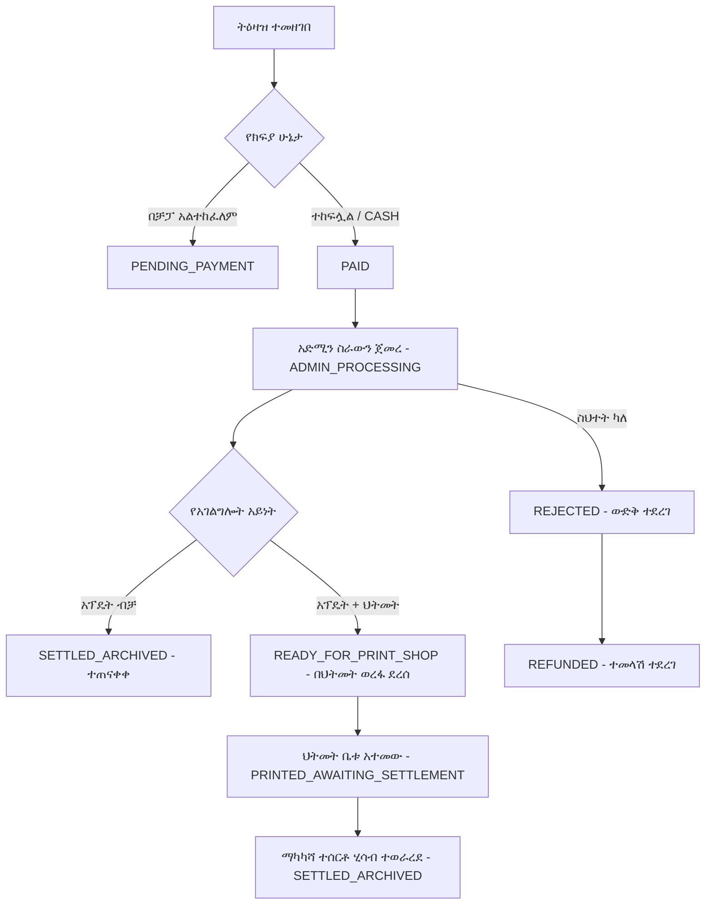

# የሲስተም አጠቃላይ ማብራሪያ እና የተጠቃሚ መመሪያ (System Documentation & User Guide)

ይህ ሰነድ የ **Update Portal** ሲስተም እንዴት እንደሚሰራ፣ የአድሚን (Admin) የስራ ድርሻ እና የህትመት ቤቶች (Print Shops) ዝርዝር አጠቃቀም፣ እንዲሁም የገንዘብ ማካካሻ (Settlements) እና የትዕዛዝ ቅደም ተከተሎችን (Workflows) በዝርዝር ያብራራል።

---

## 1. የሲስተሙ ዋና አላማ እና የስራ ፍሰት (System Overview)

ይህ ሲስተም በ **ዋና አስተዳዳሪ (Admin)** እና በ **ህትመት ቤቶች (Print Shops)** መካከል ያለውን የስራ ትስስር፣ የደንበኞች ፋይል አፕዴት እና የህትመት ሂደትን በዲጂታል መንገድ የሚያቀላጥፍ ነው።

### የትዕዛዝ አይነቶች እና የዋጋ ስሌት (Order Types & Combined Pricing)
1. **አፕዴት እና ፕሪንት (FULL_SERVICE - አፕዴት + ህትመት):**
   * ደንበኛው ሰነዱ እንዲታደስ እና ታትሞ በህትመት ቤቱ በኩል እንዲሰጠው የሚፈልግበት ሙሉ አገልግሎት ነው።
   * **የዋጋ ስሌት:** የመነሻ የህትመት ዋጋ (**350 ETB**) + የተመረጡት ማስተካከያዎች ዋጋ (ለምሳሌ ለስልክ **100 ETB** = **450 ETB**፤ ተጨማሪ ማስተካከያዎች ካሉ ተደምረው ይሰላሉ)።
   * **የገቢ ክፍፍል:**
     * **የአድሚን ድርሻ:** የአድሚን የህትመት ድርሻ (**150 ETB**) + ለእያንዳንዱ ማስተካከያ የተመደበ የአድሚን ኮሚሽን + የአድሚን ተጨማሪ ወጪ።
     * **የማተሚያ ቤት ገቢ:** የህትመት ቤቱ የህትመት ድርሻ (**200 ETB**) + ለእያንዳንዱ ማስተካከያ የተመደበ የማተሚያ ቤት ድርሻ - የሰርቨር (10 ETB) እና የ SMS (10 ETB) ክፍያዎች + የማተሚያ ቤት ተጨማሪ ወጪ።
   * አድሚኑ አፕዴት ሰርቶ የህትመት ፋይሉን (PDF) ሲጭን፣ በቀጥታ ወደ ህትመት ቤቱ **የህትመት ወረፋ (Print Queue)** ይገባል።

2. **አፕዴት ብቻ (UPDATE_ONLY):**
   * ደንበኛው የዲጂታል ሰነድ ማሻሻያ/አፕዴት ብቻ የሚፈልግ ሲሆን (ወደ ህትመት መሄድ አያስፈልገውም)።
   * **የዋጋ ስሌት:** የተመረጡት ማስተካከያዎች ዋጋ ብቻ (የህትመት መነሻ ክፍያ 0 ETB ነው)።
   * አድሚኑ ሰርቶ ሲያጠናቅቅ ፋይሉ በቀጥታ ይጠናቀቃል።

3. **የበርካታ ማስተካከያዎች ቅናሽ ህግ (Multi-Service Free Threshold):**
   * ደንበኛው ከ 3 በላይ ማስተካከያዎች ሲመርጥ ከ 3ቱ ውጪ ያሉት ተጨማሪ ማስተካከያዎች **በ 100% ነፃ (0 ETB)** ይሰላሉ።

### የክፍያ መንገዶች (Payment Methods)
1. **በቻፓ (CHAPA Online):** ደንበኛው ወይም ህትመት ቤቱ በቴሌብር፣ በሲቢኢ ብር ወይም በካርድ በቀጥታ በሲስተሙ ይከፍላል።
2. **በእጅ/በቴሌብር ለህትመት ቤቱ (CASH_TO_SHOP):** ደንበኛው ክፍያውን በቀጥታ ለህትመት ቤቱ በጥሬ ገንዘብ ወይም በባንክ ይከፍላል።

---

## 2. የህትመት ቤቶች ምዝገባ እና አቀባበል (Print Shop Registration & Onboarding)

አዳዲስ የህትመት ቤቶች ከእርስዎ ጋር አብረው እንዲሰሩ ለማድረግ **ሁለት (2)** መንገዶች አሉ፡

### መንገድ 1፡ ማተሚያ ቤቱ እራሱ የሚመዘገብበት ሊንክ (Self-Registration Page)
* ለማንኛውም አብሯችሁ መስራት ለሚፈልግ የህትመት ቤት የመመዝገቢያውን ሊንክ መስጠት ይችላሉ፡
  * **የመመዝገቢያ ሊንክ (URL):** `/am/register` (ወይም በመግቢያው `/am/login` ገጽ ላይ "እዚህ ይመዝገቡ" የሚለውን በመጫን)
* **የሚሞሉ መረጃዎች:**
  1. የማተሚያ ቤቱ ስም (Shop Name)
  2. የኢሜይል አድራሻ (Email - ለመግቢያ የሚያገለግል)
  3. ስልክ ቁጥር (Phone Number)
  4. የይለፍ ቃል (Password)
* ከተመዘገቡ በኋላ ወዲያውኑ በኢሜይላቸው እና በይለፍ ቃላቸው ወደ ሲስተሙ በመግባት ስራ መጀመር ይችላሉ።

### መንገድ 2፡ ዋና አስተዳዳሪው (Admin) በቀጥታ መዝግቦ መስጠት (Admin Direct Onboarding)
* አድሚኑ ከዳሽቦርዱ ላይ **"ህትመት ቤቶች (Manage Shops)"** (`/am/admin/shops`) የሚለውን ክፍል በመክፈት፡
  1. **"አዲስ ህትመት ቤት (Add Shop)"** የሚለውን ይጫናል።
  2. የማተሚያ ቤቱን ስም፣ ኢሜይል፣ ስልክ ቁጥር እና የይለፍ ቃል አስገብቶ ያስቀምጣል።
  3. የተፈጠረውን ኢሜይል እና የይለፍ ቃል ለማተሚያ ቤቱ በመስጠት እንዲገቡ ማድረግ ይቻላል።

---

## 3. የህትመት ቤቶች መመሪያ (Print Shop User Guide)

ህትመት ቤቶች ወደ ሲስተሙ ሲገቡ የሚከተሉትን ገጾች እና አገልግሎቶች ያገኛሉ፡

### 1. ዋና ዳሽቦርድ እና አዲስ ትዕዛዝ መመዝገቢያ (`/shop` ወይም `/shop/new-order`)
* **አዲስ ትዕዛዝ መላክ:**
  * የደንበኛውን ስም፣ ስልክ ቁጥር እና መታወቂያ/ፋይል መረጃ ያስገባሉ።
  * የአገልግሎት አይነት ይመርጣሉ (**አፕዴት ብቻ** ወይም **አፕዴት + ህትመት**)።
  * የክፍያ ዘዴ ይመርጣሉ (**CHAPA** ወይም **CASH_TO_SHOP**)።
  * የደንበኛውን ፋይል ያያይዙና **"ትዕዛዝ ላክ"** የሚለውን ይጫናሉ።

### 2. በሂደት ላይ ያሉ ትዕዛዞች (`/shop/in-progress`)
* ወደ አድሚኑ የተላኩ እና በአድሚኑ እየተሰሩ ያሉ ፋይሎች ዝርዝር ይታያል።
* የትዕዛዙ ወቅታዊ ሁኔታ (Status)፡ *Pending Payment, Paid, Admin Processing* በሚል በግልጽ ይከታተላሉ።

### 3. የህትመት ወረፋ (`/shop/print-queue`)
* አድሚኑ ሰርቶ ያጠናቀቃቸው እና ዝግጁ የሆኑ የታደሱ ፋይሎች (PDF) በዚህ ገጽ ላይ ይደርሳሉ።
* **አሰራር:**
  1. **"Download PDF"** የሚለውን በመጫን ዝግጁ የሆነውን ፋይል ማውረድና ማተም።
  2. ሰነዱ ከታተመ በኋላ **"Confirm Printed" (ህትመቱ ተጠናቋል)** የሚለውን ቁልፍ መጫን።
  3. ትዕዛዙ ወዲያውኑ ወደ ታሪክ (History) እና ወደ ማካካሻ (Settlement) ይተላለፋል።

### 4. የሂሳብ ማካካሻ (`/shop/settlements`)
* በህትመት ቤቱ እና በአድሚን መካከል ያለውን የገንዘብ ልውውጥ በግልጽ ያሳያል፡
  * **Shop Owes Admin (ህትመት ቤቱ ለአድሚን የሚከፍለው):** ደንበኞች በ Cash ለህትመት ቤቱ የከፈሉት የአፕዴት ክፍያ።
  * **Admin Owes Shop (አድሚን ለህትመት ቤቱ የሚከፍለው):** አድሚን በቀጥታ የላካቸው የህትመት ክፍያዎች (Print fee)።
  * **Net Balance (የተጣራ ቀሪ ሂሳብ):** በመጨረሻ ማን ለማን መክፈል እንዳለበት ያሰላል።
  * ክፍያ ሲፈጸም የባንክ ደረሰኝ (Receipt screenshot) በማያያዝ ማረጋገጫ መላክ ይቻላል።

### 5. የተመላሽ ጥያቄዎች (`/shop/refunds`)
* በአድሚኑ ውድቅ የተደረጉ (Rejected) ትዕዛዞች ካሉ የመመለሻ ገንዘብ (Refund) ጥያቄ የሚቀርብበት እና የሚከታተሉበት ገጽ ነው።

### 6. የታሪክ ማህደር (`/shop/history`)
* የተጠናቀቁ፣ የታተሙ እና ያለፉ ትዕዛዞች በሙሉ በዝርዝር የሚቀመጡበት እና በማንኛውም ጊዜ መረጃዎችን መፈለግ የሚቻልበት ክፍል ነው።

---

## 3. የአድሚን መመሪያ (Admin User Guide)

ዋና አስተዳዳሪው (Admin) መላውን ሲስተም የሚቆጣጠርበት እና ስራዎችን ሰርቶ የሚያጠናቅቅበት የስራ ሂደት፡

### 1. የስራዎች ዝርዝር ማኔጅመንት (`/admin/tasks`)
* ከሁሉም ህትመት ቤቶች የሚመጡ አዳዲስ የትዕዛዝ ጥያቄዎች የሚደርሱበት ማዕከል ነው።
* **የአሰራር ቅደም ተከተል:**
  1. **ስራ መጀመር (Start Working):** አዲስ ትዕዛዝ ሲመጣ "Start Working" የሚለውን በመጫን ሁኔታውን ወደ `ADMIN_PROCESSING` መቀየር።
  2. **ፋይሉን ማስተካከል/አፕዴት ማድረግ:** የደንበኛውን መረጃ መሰረት በማድረግ ማስተካከያ መስራት።
  3. **የተስተካከለ ፋይል መጫን እና ማጠናቀቅ (Complete & Upload):**
     * ስራው ሲያልቅ የተዘጋጀውን የመጨረሻ PDF ፋይል መጫን (Upload) እና **"Complete Task"** ማለት።
     * ትዕዛዙ "FULL_SERVICE" ከሆነ በቀጥታ ወደ ህትመት ቤቱ **Print Queue** ይላካል።
     * ትዕዛዙ "UPDATE_ONLY" ከሆነ በቀጥታ ይጠናቀቃል።
  4. **ስራ ውድቅ ማድረግ (Reject):** ፋይሉ ያልተሟላ ወይም የተሳሳተ ከሆነ ምክንያቱን በመጻፍ ውድቅ ማድረግ።

### 2. በሂደት ላይ ያሉ ስራዎች (`/admin/in-progress`)
* አድሚኑ አሁን ላይ በእጁ ይዞ እየሰራቸው ያሉ ስራዎችን ብቻ ለይቶ የሚያሳይ ቀለል ያለ ገጽ።

### 3. የህትመት ቤቶች አስተዳደር (`/admin/shops`)
* አዳዲስ ህትመት ቤቶችን መመዝገብ፣ መረጃቸውን ማስተካከል እና የኮሚሽን/ዋጋ ተመን ማዘጋጀት።

### 4. የዋጋ ተመን ማስተካከያ (`/admin/pricing`)
* ለእያንዳንዱ የአገልግሎት አይነት (የአፕዴት ዋጋ፣ የህትመት ዋጋ) ተመን ማውጣት እና ማሻሻል።

### 5. የሂሳብ ማካካሻ ቁጥጥር (`/admin/settlements`)
* ከህትመት ቤቶች የሚመጡ የክፍያ ማረጋገጫዎችን (Receipts) መመልከት እና ክፍያዎችን Approve በማድረግ ሂሳብ ማወራረድ።

---

## 4. የትዕዛዝ ሁኔታዎች (Status Lifecycle)

---

## 5. የቴክኖሎጂ መሰረት (Technical Architecture)

* **Frontend & Backend Framework:** Next.js 14 (App Router) + React + TypeScript
* **Styling:** Tailwind CSS + Lucide Icons + Radix UI
* **Database & ORM:** PostgreSQL (Neon Serverless) + Prisma ORM
* **Authentication:** NextAuth.js (Role-based: ADMIN, PRINT_SHOP)
* **Payment Gateway:** Chapa API Integration
* **Multilingual:** Next-Intl (Amharic & English)
